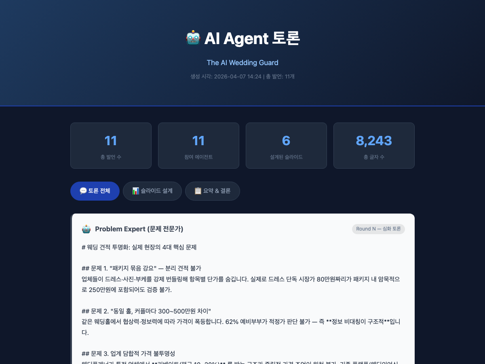
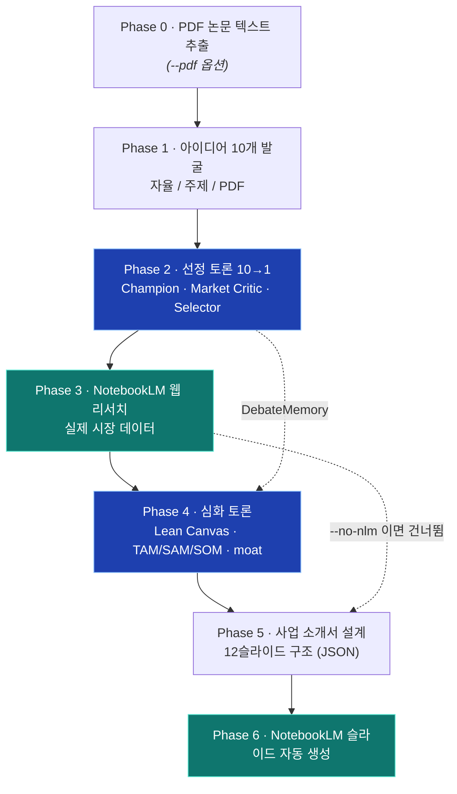

# The AI [X] Pipeline

> AI가 스스로 세상의 문제를 찾고, 토론하고, 사업 소개서를 만든다.

`Claude` 멀티 에이전트 토론 + `Google NotebookLM` 웹 리서치를 하나의 파이프라인으로 묶어,
**아이디어 발굴부터 12슬라이드 사업 소개서 자동 생성까지** 사람 개입 없이 완주합니다.



> 실행이 끝나면 위와 같은 **토론 뷰어(HTML)** 가 자동으로 열립니다. 발언 수·참여 에이전트·생성 슬라이드 통계와 함께, 각 페르소나의 발언을 라운드별로 추적할 수 있습니다. *(예시: `The AI Wedding Guard` 자동 발굴 결과)*

---

## 한눈에

- **자율 발굴**: AI가 혁신 기술 기반 신사업 아이디어 10개를 스스로 만들고, 에이전트들이 토론으로 1개를 고릅니다.
- **멀티 에이전트 토론**: Champion·Market Critic·Devil's Advocate·Lean Canvas Validator 등 **15+ 페르소나**가 서로 충돌하며 아이디어를 정제합니다.
- **실데이터 리서치**: NotebookLM이 웹에서 실제 시장 데이터를 모아 토론에 주입합니다 (`--no-nlm`으로 Claude 단독 실행도 가능).
- **결과물**: NotebookLM 슬라이드 + 토론 시각화 HTML 뷰어 + 구조화 JSON/TXT.

---

## 실행 모드

같은 엔진을 4가지 입력 방식으로 돌릴 수 있습니다.

| 모드 | 진입 | Phase 1 | 결과 |
|------|------|---------|------|
| **자율 신사업 발굴** | `--innovative-ai` | AI가 아이디어 10개 자동 생성 | 12슬라이드 사업 소개서 |
| **주제 기반 발굴** | `--innovative-ai --user-topic "..."` | 지정 주제에서 아이디어 발굴 | 12슬라이드 사업 소개서 |
| **PDF 기반 발굴** | `--innovative-ai --pdf paper.pdf` | 기술 논문에서 사업화 도메인 추출 | 12슬라이드 사업 소개서 |
| **일반 주제 리서치** | `pipeline.py "주제"` (위치 인수) | 주제 분석 → 리서치 → 토론 | 9슬라이드 리서치 발표 |

> 대화형 런처 `run.py`는 위 모드를 메뉴로 안내합니다 — `자유 토론`(일반 주제 리서치) / `아이디어 발굴`(신사업 발굴) 중 선택.

---

## 파이프라인 구조 (신사업 발굴 모드)



> 파란 단계 = Claude 멀티 에이전트 토론, 청록 단계 = NotebookLM. `DebateMemory`가 토론 맥락을 다음 Phase로 전달합니다.

---

## 에이전트 토론 구조

파이프라인의 핵심은 **두 번의 토론**입니다.  
각 에이전트는 고유한 페르소나와 관점을 가지고 충돌하며, 그 과정에서 더 좋은 아이디어가 탄생합니다.

---

### Phase 2 — 아이디어 선정 토론 (10개 → 1개)

10개의 아이디어를 놓고 에이전트들이 3라운드에 걸쳐 토론합니다.

#### 라운드 1 · 아이디어 챔피언 토론

| 페르소나 | 역할 | 관점 |
|---------|------|------|
| **Champion 1** | 아이디어 챔피언 | 담당 아이디어들(1~3번) 중 가장 잠재력 있는 것을 골라 강력히 옹호. 문제 심각성·시장 규모·경쟁 우위를 근거로 설득 |
| **Champion 2** | 아이디어 챔피언 | 담당 아이디어들(4~6번) 중 최고를 선정해 주장 |
| **Champion 3** | 아이디어 챔피언 | 담당 아이디어들(7~10번) 중 최고를 선정해 주장 |

#### 라운드 2 · 비판 & 필터링

| 페르소나 | 역할 | 관점 |
|---------|------|------|
| **Market Critic** 🔍 | 시장 비평가 | 수백 개 스타트업을 본 VC의 눈으로 냉정하게 평가. "멋있어 보이는 것"과 "실제로 돈이 되는 것"을 구분. 진입 장벽·규제 리스크·카피 리스크 분석 → Top 3 선정 |
| **Innovative AI Agent** ⚡ | 혁신 AI 전문가 | 최첨단 AI 기술 관점에서 평가. 멀티에이전트·자율 추론·데이터 플라이휠로 기존 대비 10배 임팩트를 낼 수 있는 아이디어 선별 → AI 혁신 잠재력 기준 Top 3 선정 |

#### 라운드 3 · 최종 선정

| 페르소나 | 역할 | 관점 |
|---------|------|------|
| **Selector** ✅ | 최종 선정자 | 모든 토론을 종합하여 단 하나를 선정. 기준: ① 문제 심각성 ② AI 차별성 ③ 시장 규모 ④ 실행 가능성 순으로 판단 |

---

### Phase 4 — 심화 토론 (리서치 기반)

NotebookLM이 수집한 실제 시장 데이터를 바탕으로 사업을 구체화합니다.

#### 라운드 1 · 문제 정의 & AI 솔루션 설계

| 페르소나 | 역할 | 관점 |
|---------|------|------|
| **Problem Expert** 🔬 | 문제 전문가 | 선정된 도메인의 현장 전문가. 실제 사용자가 겪는 문제 3~4가지를 수치·사례로 증명. "기존 해결책이 왜 부족한지" 구조적으로 분석 |
| **AI Solution Designer** 🛠 | AI 솔루션 설계자 | 최신 AI 기술로 현실적인 솔루션을 설계. 멀티에이전트·자율 추론·실시간 분석을 활용한 핵심 기능 3가지 정의. "The AI [X]" 서비스명 제안 |
| **Innovative AI Agent** ⚡ | 혁신 AI 아이디어러 | "AI Solution Designer의 솔루션은 너무 평범하다"는 관점에서 출발. 업계 상식을 완전히 뒤집는 급진적 아이디어 2~3개 제안. 피드백 루프·자율 학습·예측 등 구체적 기술 메커니즘 포함 |
| **Devil's Advocate** 😈 | 비판적 검토자 | Solution Designer와 Innovative Agent 아이디어 모두의 치명적 약점 지적. 기술 구현 난이도·경쟁자·규제 리스크·사용자 수용성 분석. 두 아이디어를 결합하면 더 강해지는 포인트도 제안 |

#### 라운드 2 · 사업 모델 & 시장 검증

| 페르소나 | 역할 | 관점 |
|---------|------|------|
| **Business Architect** 🏗 | 사업 설계자 | 토론 결과를 수익성 있는 사업으로 전환. 타겟 고객·수익 모델(구독/수수료/B2B)·수치 추정·MVP 3가지·초기 GTM 전략 설계 |
| **Lean Canvas Validator** 📋 | 린캔버스 검증가 | 린스타트업 방법론으로 9블록(Problem·Customer·UVP·Solution·Channels·Revenue·Cost·Metrics·Unfair Advantage) 검증. 지금 당장 검증하지 않으면 사업이 무너질 **가장 위험한 가정 Top 3**와 2주 안에 실행 가능한 MVE(최소검증실험) 제시 |
| **Market Validator** 📊 | 시장 검증가 | VC 관점에서 투자 매력도 검증. TAM/SAM/SOM 추정, 직접 경쟁자 분석, AI 차별점이 만드는 해자(moat), 시리즈 A 마일스톤 정의 |
| **Strategist** 🎯 | 전략 합성가 | 전체 토론을 통합하여 최종 방향 확정. 서비스명·한 줄 tagline·AI 차별점·투자자에게 전달할 핵심 메시지 한 문장 도출 |

#### 라운드 3+ · 심화 검토 (선택적)

| 페르소나 | 역할 | 관점 |
|---------|------|------|
| **Domain Expert** 🏛 | 도메인 현장 전문가 | 20년 경력 현장 전문가. 실제 도입 시 가장 먼저 요구할 기능·가장 큰 저항·성공 조건 분석 |
| **Investor** 💰 | VC 투자자 | AI 스타트업 전문 VC. 투자 결정/거부 요인, 글로벌 유사 성공 사례, 한국 시장 특수 기회/위험 분석 |

#### 최종 합의

| 페르소나 | 역할 | 관점 |
|---------|------|------|
| **Moderator** ⚖️ | 종합 분석가 | 전체 토론을 종합하여 사업 소개서 핵심 내용 확정. 서비스명·문제 한 줄 요약·AI 차별점·타겟 고객·수익 모델·투자자 메시지 정리 |

---

## 사업 소개서 슬라이드 구조 (12장)

Phase 5에서 토론 결과를 12슬라이드 구조로 설계해 NotebookLM에 넘깁니다.

| # | 슬라이드 | type | 내용 |
|---|---------|------|------|
| 1 | 타이틀 | `title` | 서비스명 + tagline |
| 2 | 문제 데이터 | `problem_data` | 시장 수치로 문제 크기 증명 |
| 3 | 구조적 문제 | `problem_structure` | 3~4가지 구조적 문제 |
| 4 | 기존 대안 | `competitive` | 기존 서비스의 한계·병목 |
| 5 | 차별점 | `differentiation` | 우리 솔루션만의 차별점 2~3가지 |
| 6 | 린캔버스 | `lean_canvas` | 9블록 요약 + 가장 위험한 가정 Top 3 & 검증 계획 |
| 7 | 시장 조사 | `market` | TAM/SAM/SOM 또는 핵심 시장 데이터 |
| 8 | 고객 정의 | `customer` | 타겟 세그먼트 (얼리어답터 중심) |
| 9 | 비즈니스 모델 | `business` | 수익 구조 + 수치 추정 |
| 10 | MVP | `mvp` | 핵심 기능 3가지 |
| 11 | 실행 로드맵 | `roadmap` | 6개월/12개월 마일스톤 |
| 12 | 비전 | `vision` | 최종 가치 제안 |

> 일반 주제 리서치 모드는 `title·problem·research·solution·debate·strategy·technical·business·vision` 9슬라이드로 설계됩니다.

---

## 사용 방법

### 1. 설치

```bash
git clone https://github.com/leten02/the-ai-x-pipeline
cd the-ai-x-pipeline

python3 -m venv .venv
.venv/bin/pip install anthropic notebooklm-cli pymupdf keyring
```

> Python 3.10+ 필요. `pymupdf`는 PDF 모드, `keyring`은 `run.py`의 API 키 보관(맥 키체인)에 쓰입니다.

### 2. 인증

**Anthropic API Key** — 환경변수 또는 맥 키체인(`run.py`가 자동 저장):
```bash
export ANTHROPIC_API_KEY="sk-ant-..."
```

**NotebookLM 로그인** (Chrome에 Google 계정 로그인 상태 필요):
```bash
.venv/bin/nlm login
```
> NotebookLM 없이 Claude 단독으로 돌리려면 이 단계를 건너뛰고 `--no-nlm`을 쓰세요.

### 3. 실행

```bash
# 대화형 런처 (추천) — 모드·주제·옵션을 메뉴로 안내
.venv/bin/python3 run.py

# 자율 신사업 발굴
.venv/bin/python3 pipeline.py --innovative-ai --rounds 3 --mode fast

# 주제 기반 신사업 발굴
.venv/bin/python3 pipeline.py --innovative-ai --user-topic "노인 돌봄" --user-problem "야간 돌봄 공백"

# PDF 논문 기반 발굴
.venv/bin/python3 pipeline.py --innovative-ai --pdf paper.pdf

# 일반 주제 리서치 (NLM 없이)
.venv/bin/python3 pipeline.py "전기차 충전 인프라" --no-nlm
```

### 옵션

| 옵션 | 설명 | 기본값 |
|------|------|--------|
| `topic` | 일반 주제 리서치 대상 (위치 인수, 발굴 모드에선 생략) | — |
| `--innovative-ai` | 혁신 AI 기반 신사업 자동 발굴 모드 | off |
| `--user-topic` | 발굴 모드에서 지정할 주제 | — |
| `--user-problem` | 사용자가 정의한 문제점 (발굴에 반영) | — |
| `--pdf FILE...` | 사업화 도메인을 추출할 기술 논문 PDF | — |
| `--rounds` | 심화 토론 라운드 수 | 2 |
| `--mode` | NLM 검색 모드 (`fast` 30초 / `deep` 5분) | `fast` |
| `--no-nlm` | NotebookLM 없이 Claude만 사용 | off |
| `--lang` | NLM 리포트 언어 | `ko` |
| `--out` | 출력 디렉토리 | `output` |

---

## 결과물

실행 후 `output/` 폴더에 생성 (HTML 토론 뷰어는 자동으로 열립니다):

| 파일 | 내용 |
|------|------|
| NotebookLM 슬라이드 | `notebooklm.google.com`에서 확인 |
| `*_토론뷰어.html` | 전체 에이전트 토론을 말풍선으로 시각화 |
| `*_design_*.json` | 사업 소개서 슬라이드 구조 데이터 |
| `*_framework_*.json` | 아이디어 프레임(후보 도메인·선정 결과) |
| `*_debate_*.txt` | 에이전트 토론 전문 텍스트 |
| `*_research_*.txt` | NotebookLM 리서치 Q&A |

---

## 아웃풋 예시

파이프라인이 자율적으로 발굴한 사업 아이디어:

| 서비스명 | 도메인 | 핵심 문제 |
|---------|--------|----------|
| The AI Caregiver | 노인 돌봄 | 돌봄 인력 부족 & 고비용 |
| The AI Accountant | 세무/회계 | 중소기업 세무 접근성 |
| The AI Taxmate | 세금 신고 | 개인 세금 신고 복잡성 |

---

## 기술 스택

| 구성요소 | 역할 |
|---------|------|
| **Claude (`claude-sonnet-4-6`)** | 아이디어 생성, 멀티 에이전트 토론, 사업 소개서 설계 |
| **Google NotebookLM** | 웹 리서치, 슬라이드 자동 생성 |
| **notebooklm-cli (`nlm`)** | NotebookLM 자동화 연동 |
| **PyMuPDF** | PDF 논문 텍스트 추출 (Phase 0) |
| **keyring** | API 키 맥 키체인 보관 |

핵심 설계: `DebateMemory`가 라운드마다 토론 맥락을 누적해 다음 에이전트에 주입하고,
각 Phase 산출물을 JSON으로 구조화해 NLM 리서치·슬라이드 단계로 핸드오프합니다.

---

## `/the-ai-x-pipeline` — Claude Code 스킬

GitHub에서 받아 스킬 폴더에 넣으면, Claude Code에서 **슬래시 커맨드 `/the-ai-x-pipeline`** 으로
바로 부를 수 있습니다. (`"신사업 발굴해줘"` 처럼 자연어로 말해도 자동 트리거됩니다.)

### 설치 (한 줄)

```bash
git clone https://github.com/leten02/the-ai-x-pipeline /tmp/aix \
  && cp -r /tmp/aix/the-ai-x-pipeline-skill ~/.claude/skills/the-ai-x-pipeline
```

> 설치 위치는 반드시 폴더명을 **`the-ai-x-pipeline`** 으로 맞춰야 슬래시 커맨드 이름이 일치합니다.
> ZIP으로 받으려면 저장소 **Code → Download ZIP** 후 `the-ai-x-pipeline-skill/` 폴더만
> `~/.claude/skills/the-ai-x-pipeline/` 로 옮기세요.

### 사용

```
/the-ai-x-pipeline           # 스킬 호출 → 모드 선택 안내
```
또는 자연어로: `"신사업 아이디어 발굴해줘"`, `"이 주제로 발표자료 만들어줘"`.
스킬이 셋업(클론·venv·키)부터 실행, 결과 안내까지 처리합니다.

> Claude Code는 세션 시작 시 스킬을 로드합니다. 설치 후 **새 세션**에서 인식됩니다.

### 구조

```
~/.claude/skills/the-ai-x-pipeline/
├── SKILL.md                  # 트리거 + 셋업 + 실행 규칙
└── references/
    ├── modes.md              # 4가지 실행 모드 & 플래그
    ├── personas.md           # 15+ 에이전트 페르소나
    └── troubleshooting.md    # 인증·NLM·비용 문제 해결
```

---

## 주의사항

- NotebookLM은 Google 계정 로그인이 필요합니다 (`--no-nlm`으로 우회 가능)
- Anthropic API 비용이 발생합니다 (실행당 약 $0.05~0.20)
- NLM 세션은 약 20분 후 만료 — 명령이 실패하면 `nlm login` 재실행

---

## 테스트

결정적 코어(JSON 복구·토론 메모리·ANSI 처리)에 대한 회귀 테스트를 제공합니다.
LLM 호출·NotebookLM·대화형 TUI는 네트워크·API 키·Chrome 의존이라 단위 테스트 대상에서 제외했습니다.

```bash
.venv/bin/python3 -m unittest discover tests -v
# Ran 10 tests — OK
```

| 대상 | 검증 |
|------|------|
| `safe_json` | 정상 JSON · 코드펜스 · 산문 내장 · **잘린 JSON 복구** · 가비지→`{}` |
| `DebateMemory` | 발언 기록 · `last_n` 최근 N개 · 결론 누적 |
| `strip_ansi` | 컬러코드 제거 · 평문 보존 |

---

## 라이선스

MIT
